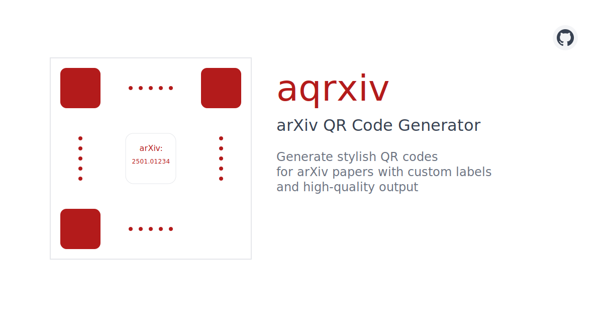

<div align="center">
  
  <h1>aqrxiv</h1>
  <p>Generate stylish QR codes for arXiv papers with custom center labels and high-quality output</p>
</div>

## Features

- Generate QR codes from arXiv ID or URL
- High-resolution PNG output
- Custom center labels with arXiv styling
- Shareable URLs
- One-click download

## Development

```bash
npm install
npm run dev
```

## Legal

This project is not affiliated with arXiv.

## Contributing

Contributions are welcome! Please feel free to submit a Pull Request. For major changes, please open an issue first to discuss what you would like to change.

Please make sure to update tests as appropriate and follow the existing code style.

## License

This project is licensed under the Apache License 2.0 - see the [LICENSE](LICENSE) file for details.

## ☕ Support

Like this project? You can support its development by buying me a coffee!

<a href="https://coff.ee/miyaorg030m">
  
</a>
